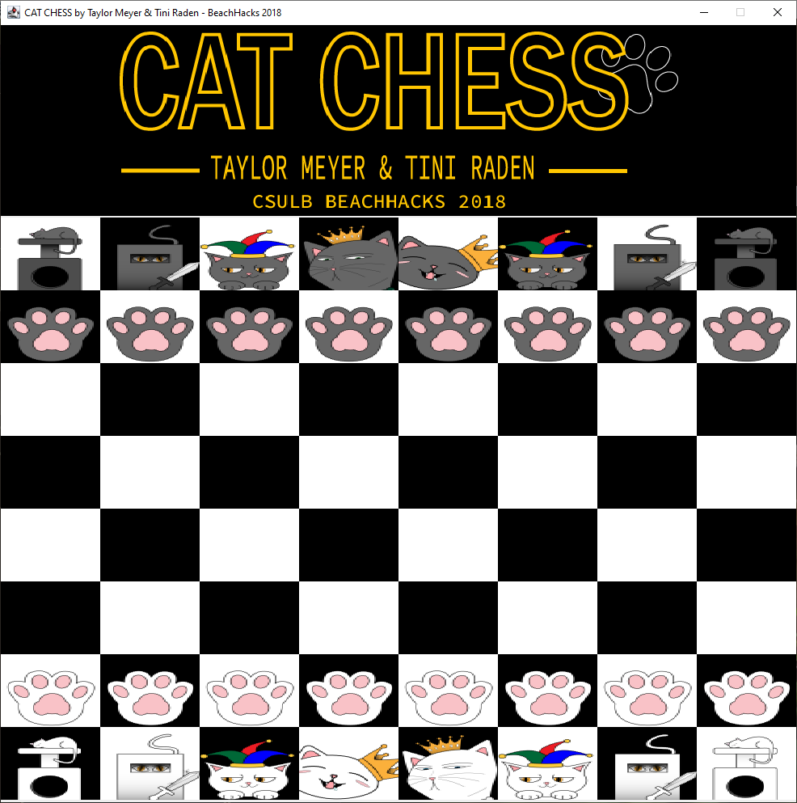

# Cat Chess
This project was built during Beachhacks 2018 at Cal State University, Long Beach. A friend drew the artwork for the pieces ahead of time.

Written in Java using AWT, but I plan on migrating to JavaFX and redoing/cleaning up a lot of the code.

Used: MouseListener, JLabel. The GUI is arranged by reading data from a two-dimensional array and placing the correct images in the correct place. The board itself is a series of "squares" with their background colored black or white.

## Images
